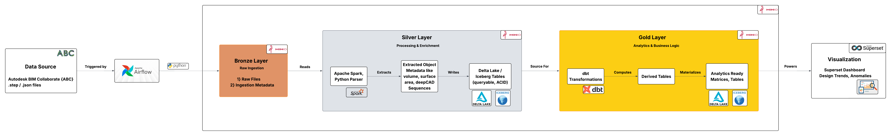

# CAD Data Lakehouse Pipeline

An end-to-end data engineering platform for CAD (Computer-Aided Design) data. Implements a **Medallion Architecture** (Bronze → Silver → Gold) using industry-standard tools.

## Architecture



## Tech Stack

| Layer          | Technology                        |
|----------------|-----------------------------------|
| **Storage**    | MinIO (S3-compatible)             |
| **Ingestion**  | Python + boto3                    |
| **Processing** | Apache Spark + pythonocc-core     |
| **Modeling**   | dbt (data build tool)             |
| **Orchestration** | Apache Airflow                 |
| **Visualization** | Apache Superset                |
| **Infrastructure** | Docker Compose               |

---

## Step-by-Step Guide to Run Locally

### Prerequisites
Make sure you have [Docker Desktop](https://www.docker.com/products/docker-desktop/) installed and running.

### 1. Start the Platform
Open your terminal in the root directory of this project and safely build/start all containers:
```bash
docker-compose up -d --build
```
*Note: This will spin up Airflow, MinIO, Spark, Postgres, and Superset. Superset might take an extra minute or two to initialize its database.*

### 2. Retrieve Airflow Credentials
Airflow automatically generates an admin password on its first boot. Run this to find it:
```bash
docker exec airflow cat standalone_admin_password.txt
```

### 3. Access the UIs
Now that the platform is running, you can access the following web interfaces:

| Service       | URL                          | Credentials         |
|---------------|------------------------------|----------------------|
| **Airflow**   | http://localhost:8085         | `admin` / *(from step 2)* |
| **MinIO**     | http://localhost:9001         | `admin` / `password` |
| **Spark UI**  | http://localhost:8080         | —                    |
| **Superset**  | http://localhost:8088         | `admin` / `admin`    |

### 4. Run the Data Pipeline (via Airflow)
1. Go to the **Airflow UI** (http://localhost:8085).
2. Look for the DAG named `cad_master_pipeline`. 
3. Toggle the DAG to unpause it, then click the **Trigger (Play)** button.
4. This master DAG will automatically orchestrate:
   - Creating the Bronze, Silver, and Gold buckets in MinIO.
   - Ingesting sample `.step` files into Bronze.
   - Pinging the Spark container to prompt you to process data to Silver.
   - Pinging the dbt container to prompt you to process data to Gold.

### 5. Execute the Data Processing Nodes
Because Docker socket mounting is excluded for local security, you will manually execute the actual processing clusters when Airflow reaches those DAG steps:

**Process Bronze to Silver (Spark):**
Extracts 3D geometry features (like volume and surface area).
```bash
docker exec spark-master /opt/spark/bin/spark-submit /opt/spark/scripts/process_cad.py
```

**Process Silver to Gold (dbt):**
Cleans and models the features into final analytical Fact schemas.
```bash
docker exec -w /opt/spark/dbt spark-master dbt run --profiles-dir .
```

### 6. Visualize in Superset
1. Go to **Superset** (http://localhost:8088) using `admin` / `admin`.
2. Connect Superset to your data source.
3. Build your CAD analytics dashboards!

### 7. Shutting Down
When you're finished and want to safely spin down the platform and preserve your data volumes:
```bash
docker-compose down
```
If you ever want to completely wipe all data and start fresh, run: `docker-compose down -v`

## Architecture Decisions & Current Limitations

To maintain a lightweight, local-first Docker architecture that can run reliably on standard hardware without relying on expensive cloud infrastructure or massive image sizes, the following design trade-offs were made:

1. **Storage Formats**: Instead of heavy data lakehouse engines like **Delta Lake** or **Apache Iceberg**, the Silver layer utilizes standard **Apache Parquet**. This provides columnar compression without requiring hundreds of megabytes of external AWS-Delta Java JAR dependencies.
2. **Gold Layer Materialization**: Because the Spark container is optimized to run without `hadoop-aws` connectors, `dbt` is configured to materialize the final analytical Gold tables natively inside the Spark SQL cluster (`spark-warehouse/` directory) rather than writing them back out to the MinIO cloud bucket.
3. **Data Source Scope**: While the data consists of industry-standard `.step` files (like those originating from Autodesk BIM), the ingestion pipeline relies on the open-source "A Big CAD Model Dataset" (ABC) published by NYU to prioritize public accessibility without proprietary API keys.
4. **Processing Scope**: The PySpark parser heavily utilizes `pythonocc` to dynamically calculate geometric attributes like 3D `volume` and `surface_area`. Advanced ML point-cloud derivations (e.g. sequence extraction) are currently scoped out.

---

## Project Structure
```text
├── dags/                      # Airflow DAG definitions
├── scripts/                   # Spark processing scripts
├── dbt/                       # dbt project for Gold layer
├── data/                      # Sample raw CAD files
├── Dockerfile                 # Custom Spark image with pandas & pythonocc
├── docker-compose.yml         # Defines Airflow, MinIO, Spark, and Superset
└── requirements.txt           # Python dependencies
```
